<p align="center">
  
</p>

<p align="center">
  <a href="https://www.npmjs.com/package/caraka"></a>
  <a href="LICENSE"></a>
  <a href="https://nodejs.org">= 22"></a>
  <a href="https://agentclientprotocol.com"></a>
  <a href="docs/roadmap.md"></a>
</p>

<p align="center">
  <a href="https://caraka.dev"><b>caraka.dev</b></a> ·
  <a href="docs/blueprint.md">Blueprint</a> ·
  <a href="docs/install-guide.md">Install</a> ·
  <a href="docs/security.md">Threat model</a> ·
  <a href="docs/roadmap.md">Roadmap</a> ·
  <a href="README.id.md">🇮🇩 Bahasa Indonesia</a>
</p>

> **v0.2.** Usable in a private chat and in allowlisted groups, with Claude Code over ACP. English and Indonesian. `caraka service` prints a unit file you install yourself. Memory, attachments, and coding agents other than Claude Code are not in this release.

---

## What it is

Coding agents are locked to one terminal on one machine. Caraka is the missing transport — a thin bridge, not another assistant.

It has **no agent loop, no tools, no model provider, and no plugin marketplace.** Your coding agent already has all of those, and its versions are better: real sandboxing, repo context, diff review, git awareness. Caraka adds only what chat needs — identity, sessions, approvals, and audit.

<p align="center">
  
</p>

<details>
<summary>Same thing, as plain text</summary>

```
        Telegram (private chat = workspace)
        ├── 📋 General                            ← control
        ├── ▸ toko-api · rate limit login   #a91  ← session = topic = "tab"
        ├── ⏸ toko-api · dependency audit   #a92  ← waiting for your approval
        └── ✓ web · hero revision           #a85  ← done, summary posted
                        │
                  ┌─────▼─────┐
                  │  caraka   │  identity · router · topics
                  │           │  policy · approval · audit
                  └─────┬─────┘
                        │ ACP (Agent Client Protocol)
                        ▼
              your coding agent — runtime, tools, sandbox, model
```

</details>

## Install

Node.js 22+, Git, and an authenticated Claude Code installation.

```bash
claude auth status
npx caraka init
npx caraka doctor
npx caraka start
```

`init` validates the bot token through Telegram, opens a one-time pairing link, asks for confirmation in the terminal, then stores the token outside `config.yaml` in a mode-`0600` file. Create the token with [@BotFather](https://t.me/BotFather). Do not paste it into an issue or into an AI chat.

Enable topic mode for the bot in BotFather if you want one Telegram topic per session. Where topics are unavailable, Caraka keeps working in linear mode with a session header.

Installing globally is optional:

```bash
npm install --global caraka
caraka init
caraka start
```

### Ask Codex or Claude to help

Paste this into either coding agent. It handles the environment checks and explains the rest, and it is written so the agent never asks you to send the Telegram token through chat.

```text
Install Caraka for the repository in my current working directory.

Read https://github.com/CarakaDev/caraka first. Verify Node.js 22 or newer,
Git, Claude Code, and `claude auth status`. Fix only missing prerequisites that
can be installed without changing my repository. Then run `npx caraka doctor`
if Caraka is already configured.

For Telegram pairing, never ask me to paste, reveal, or repeat the bot token in
chat, command output, logs, or a committed file. Tell me to create a bot with
@BotFather, then hand me this exact command to run myself in a local terminal:

  npx caraka init --workspace "$PWD"

Wait while I enter the token privately and approve the Telegram deep link.
After I confirm init is complete, run `npx caraka doctor`, explain any failed
check, and start it with `npx caraka start`. Do not enable a webhook, open a
port, install a service, or modify Claude's model/provider configuration.
```

Some coding-agent clients can hold an interactive terminal open for the wizard. If yours cannot, run the one `init` command yourself and let the agent continue with `doctor` and `start`. That boundary is what keeps the token out of the conversation transcript.

## Using it

Send ordinary text to give Claude a task. Eight commands cover the rest:

| | |
|---|---|
| `/new` | start a fresh session |
| `/status` | report the state of this conversation's session |
| `/stop` | cancel the running task |
| `/commands` | list the commands the agent reported |
| `/usage` | report the context and cost the agent reported |
| `/yolo <duration>` | open a Caraka trust window for a stated duration |
| `/lock` | close the trust window now |
| `/help` | explain how to send a task |

Permission requests arrive as **Allow once** and **Reject** buttons. Each callback is signed, bound to the Telegram principal and the session, expires after ten minutes, and works once. Chat text is never read as approval.

## Why it's small

One protocol does the heavy lifting. [ACP](https://agentclientprotocol.com) is the LSP-equivalent for coding agents: JSON-RPC 2.0 over stdio, created by Zed, co-led by JetBrains, with 28+ agents in its registry. Writing **one** ACP client is what keeps the door open to the rest of them — v0.2 drives Claude Code, and the others are a preset away rather than a rewrite.

ACP also ships `session/request_permission`, so the approval system is not something Caraka invents. It renders the protocol's own permission requests as buttons in your chat.

## Sessions are tabs

Since 2026, Telegram bots can create forum topics **in a private chat, with no admin rights at all.** That turns a DM with your bot into a tabbed workspace at zero setup cost.

One session = one topic. Caraka names it, marks its state with a glyph in the name (▸ running · ⏸ needs you · ✓ done · ✗ failed), and posts a closing summary. The icon colour is chosen when the topic is created — Telegram's `editForumTopic` can change a topic's name and emoji afterwards, but not its colour. The topic list becomes a status board you can read at a glance without opening anything.

## Safe by default

Caraka connects untrusted input (chat) to code execution on your machine. It is deliberately boring out of the box:

- Private chats and an explicit allowlist are **mandatory** — the gateway refuses to start without one
- Writes and commands require approval; approvals are **signed, single-use callbacks with a TTL**, so chat text can never approve anything
- No channel listens. Telegram is long-polled and Discord is an outbound WebSocket, so nothing has to be opened to the internet. Since v0.5 one socket exists on the machine and it is not a channel: `caraka dashboard` serves a read-only page on `127.0.0.1` and answers GET only
- The bot token and the approval key are separate mode-`0600` files under `~/.caraka/secrets/`
- Every outbound message and every audit entry passes through the secret scrubber
- The SQLite audit table rejects updates and deletes
- Model API keys are never touched — those belong to your coding agent

Read the [threat model](docs/security.md) before connecting a sensitive repository.

## Philosophy

**Caraka** (ꦕꦫꦏ, Javanese: *envoy*) is the first word of the Javanese script, from the legend of Aji Saka's two loyal servants:

> ꦲꦤꦕꦫꦏ · *hana caraka* — there were two envoys
> ꦢꦠꦱꦮꦭ · *data sawala* — they disagreed
> ꦥꦝꦗꦪꦚ · *padha jayanya* — they were equally strong
> ꦩꦒꦧꦛꦔ · *maga bathanga* — both became corpses

Both obeyed perfectly. Both were right according to the instructions they held. Both died — killed not by disloyalty but by **loyalty without context**: two orders that collided, no way to verify, and no human between them at the moment it mattered.

That is why this project has approvals and an audit trail. See [docs/brand.md](docs/brand.md).

## What is not in v0.2

Memory is specified and not shipped. When it arrives it will use [Titen](https://titen.dev) — agent memory that never flattens a conclusion into its evidence, with deterministic claim extraction and no model in the loop. Titen and Caraka are written by the same author: one remembers, one is sent.

Attachments and coding agents other than Claude Code are also specified and not shipped. [roadmap.md](docs/roadmap.md) has the order and the gate that can cancel each next phase.

Two things that did ship carry a condition worth knowing.

**Groups.** Adding a group to the allowlist means choosing to show that work to its members: approval cards, file paths, diffs, and command output are readable by every member. Telegram's ephemeral replies cannot hide them — they only work for 15 seconds after a qualifying action, or if the bot is a chat admin, and Caraka never asks to be one. What stays closed is the decision: an approval button is only valid from an account on the sender allowlist, so other members can read a card without being able to answer it.

Privacy mode stays on, which is why an ordinary message in a group never reaches the bot. Address it — `/new@yourbot …` — or reply to one of its own messages. Turning that off, or granting the admin rights that group topics require, makes the bot receive every message in the group. Caraka never asks for either; `/status` in a group reports which of them is in force.

**Background services.** `caraka service --print` writes a systemd, launchd, or schtasks unit to stdout for you to install yourself. Caraka never installs one, has no `postinstall` hook, and never prints the word `sudo`.

## Verify from source

```bash
npm install
npm run lint
npm run typecheck
npm test
npm run e2e
npm run smoke   # requires authenticated Claude Code
```

## Documentation

| | |
|---|---|
| [install-guide.md](docs/install-guide.md) | Setup, step by step |
| [install-with-ai.md](docs/install-with-ai.md) | The prompt above, and why it is shaped that way |
| [blueprint.md](docs/blueprint.md) | One-page overview and locked decisions |
| [session-model.md](docs/session-model.md) | Sessions as topics: lifecycle, routing, housekeeping |
| [design.md](docs/design.md) | Architecture, interfaces, protocols |
| [security.md](docs/security.md) | Threat model and controls |
| [roadmap.md](docs/roadmap.md) | Phases and decision gates |
| [research/](docs/research/) | Thirteen sourced research documents |

## Contributing

See [CONTRIBUTING.md](CONTRIBUTING.md). Vulnerabilities go to `security@caraka.dev` — see [SECURITY.md](SECURITY.md).

## License

MIT — see [LICENSE](LICENSE).

---

`halo@caraka.dev` · [caraka.dev](https://caraka.dev)
